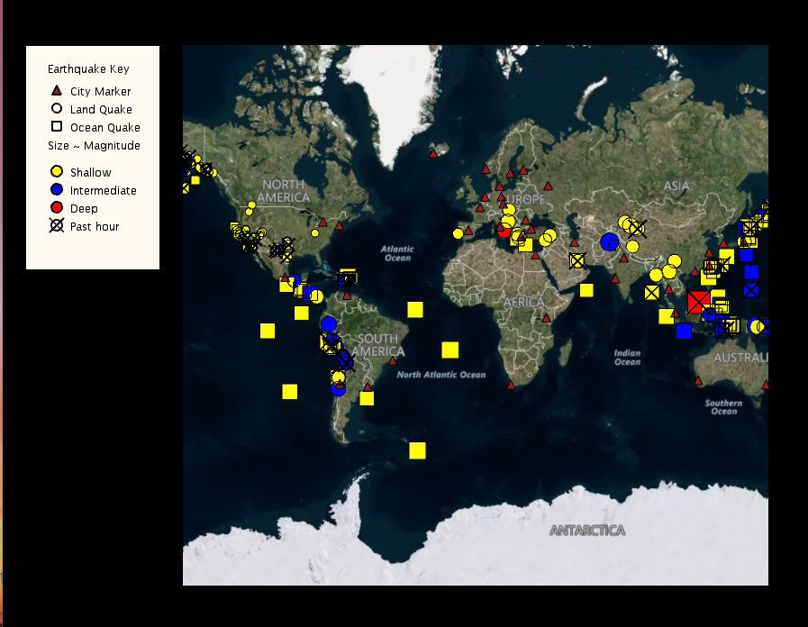

# 🌍 Mapeamento Interativo de Terremotos: UCSD OOP Capstone


## 📖 Sobre o Projeto
Este repositório contém o projeto de conclusão (Capstone) do curso **Object-Oriented Programming in Java**, oferecido pela **Universidade da Califórnia, San Diego (UCSD)**. 

Trata-se de uma aplicação interativa de visualização geoespacial desenvolvida em Java. A aplicação lê feeds de dados reais (RSS) de terremotos ao redor do globo e os renderiza visualmente em um mapa interativo, permitindo ao usuário filtrar eventos por magnitude, verificar o raio de ameaça de tsunamis em oceanos ou em terra firme.

## 🧠 Arquitetura e Lógica Aplicada (POO)
O principal objetivo deste projeto não é apenas exibir o mapa, mas sim demonstrar o domínio sólido dos pilares da **Programação Orientada a Objetos**:

* **Herança e Polimorfismo:** Implementação de hierarquias de classes complexas para os marcadores do mapa. Por exemplo, a classe mãe `EarthquakeMarker` divide-se nas classes filhas `LandQuakeMarker` e `OceanQuakeMarker`, cada uma com comportamentos de desenho (`draw`) sobrepostos de forma polimórfica.
* **Classes Abstratas e Interfaces:** Uso de `CommonMarker` como uma classe abstrata que gerencia estados comuns (como esconder/mostrar informações ao passar o mouse), forçando as subclasses a implementarem os detalhes de renderização.
* **Estruturas de Dados:** Uso intensivo de coleções em Java (como `List`, `HashMap`) para armazenar, ordenar e buscar dados em tempo real sobre os terremotos e cidades.
* **Algoritmos de Ordenação e Busca:** Implementação de lógicas de comparação (usando `Comparable` e `Comparator`) para ordenar terremotos por magnitude e buscar elementos no mapa de forma eficiente.

## ✨ Funcionalidades do Mapa
- **Visualização Dinâmica:** Marcadores coloridos categorizados por profundidade e tamanho indicando a magnitude do terremoto.
- **Análise de Ameaça:** Marcadores no oceano (`OceanQuakeMarker`) exibem um raio de impacto para indicar a possibilidade de tsunamis em cidades próximas (`CityMarker`).
- **Interatividade:** Passar o mouse sobre um terremoto ou cidade revela detalhes da localização, data e magnitude. Clicar em um terremoto oculta todos os outros eventos, focando a visualização nas áreas afetadas.
- **Filtragem Espacial e Relatórios no Terminal:** Implementação analítica customizada baseada em eventos de clique. Ao selecionar uma cidade ou terremoto, o algoritmo filtra o mapa visualmente (ocultando marcadores fora da zona de ameaça) e processa os dados em tempo real, imprimindo um relatório estatístico no console com o número de tremores próximos, a magnitude média e a maior ameaça registrada para o local.

## 🛠️ Tecnologias e Bibliotecas
* **Java 8:** Linguagem principal do projeto.
* **Unfolding Maps / Processing:** Bibliotecas de núcleo gráfico para gerenciamento e interatividade do mapa de blocos (tile-based map).

### 🗺️ Demonstração Visual do Mapa



*Figura 1: Interface gráfica renderizando os terremotos globais e os marcadores dinâmicos através do Unfolding Maps.*

## 🚀 Como Executar o Projeto

1. Clone o repositório na sua máquina local:
   ```bash
   git clone [https://github.com/Rafa-colombo/Seu-Nome-De-Repositorio.git](https://github.com/Rafa-colombo/MapeamentoIterativoJava.git)
   
2. Abra a sua IDE preferida para Java (Eclipse, IntelliJ ou VS Code).

3. Importe o diretório clonado como um projeto existente.

4. Certifique-se de que a pasta lib/ está adicionada ao Build Path (Caminho de Compilação) do projeto para que a IDE reconheça as dependências do Unfolding Maps.

5. Navegue até src/module6/EarthquakeCityMap.java (ou a classe principal que deseja rodar).

6. Execute o arquivo como "Java Application". O mapa gráfico será aberto em uma nova janela.
